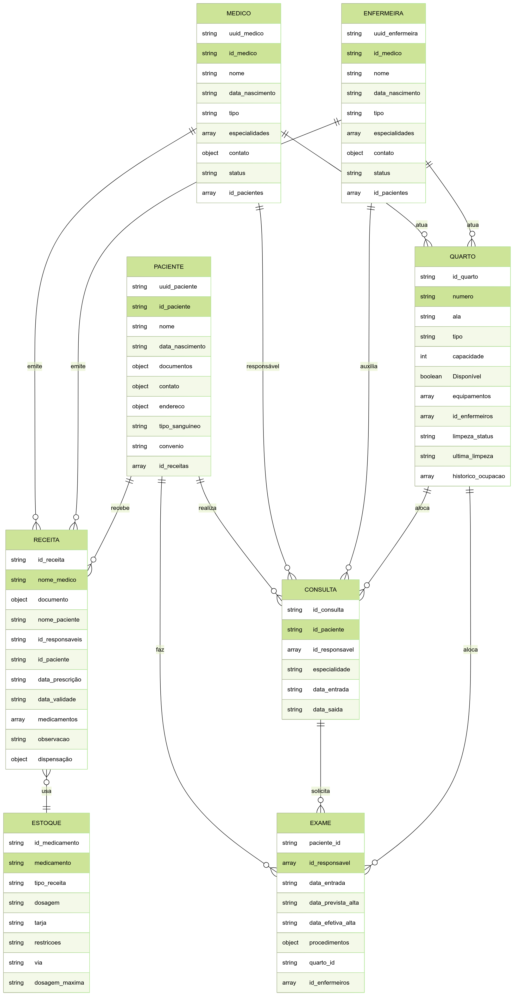

  
  # 🏥 Hospital - Banco de Dados NoSQL
  
  <!-- Enhanced Banner with More Colors -->
  
   
    
  
  
  
  

---

<!-- ANIMATED TOC SECTION with Enhanced Colors -->

<b>📑 NAVEGAÇÃO RÁPIDA</b>

|   | Seção               |   | Seção                  |
|:-:|:--------------------|:-:|:-----------------------|
| 🔍 | [Visão Geral](#-visão-geral) | 🎯 | [Objetivos](#-objetivos) |
| 📊 | [Estrutura](#-estrutura-de-dados) | 🚀 | [Casos de Uso](#-casos-de-uso) |
| 🔄 | [Arquitetura](#-arquitetura) | 📋 | [Instruções](#-instruções-da-atividade) |
| 💻 | [Tecnologias](#-tecnologias) | ⚠️ | [Aviso](#%EF%B8%8F-aviso) |

---

<!-- MAIN CONTENT with Enhanced Colors -->
## 🔍 VISÃO GERAL

> **Bem-vindo ao projeto Hospital!**

Este sistema representa uma **revolucionária** abordagem à gestão de dados hospitalares utilizando arquitetura **NoSQL** para maior flexibilidade, escalabilidade e performance.

`Por que NoSQL para hospitais?` Ambientes de saúde exigem estruturas de dados flexíveis que possam se adaptar rapidamente a diferentes:
* 🧑‍⚕️ Tipos de pacientes e condições
* 📋 Protocolos médicos em evolução
* 📜 Requisitos regulatórios em constante mudança
* 🔄 Integração com diversos sistemas eletrônicos

 

## 📊 ESTRUTURA DE DADOS

Nossa base de dados é organizada em documentos JSON, cada um representando uma entidade crítica no ecossistema hospitalar:

<table>
<tr style="background-color:#E3F2FD">
  <th width="25%">Documento</th>
  <th width="35%">Descrição</th>
  <th width="45%">Atributos Principais</th>
</tr>
<tr style="background-color:#F3E5F5">
  <td> <b> Paciente.json</b></td>
  <td>Cadastro completo de pacientes</td>
  <td><code>id</code>, <code>nome</code>, <code>data_nascimento</code>, <code>cpf</code>, <code>tipo_sanguineo</code>, <code>alergias[]</code>, <code>convenio</code></td>
</tr>
<tr style="background-color:#E8F5E9">
  <td> <b> Médico.json</b></td>
  <td>Perfil dos médicos e especialidades</td>
  <td><code>id</code>, <code>nome</code>, <code>crm</code>, <code>especialidades[]</code>, <code>pacientes[]</code></td>
</tr>
<tr style="background-color:#FFF3E0">
  <td> <b> Enfermeira.json</b></td>
  <td>Equipe de enfermagem e atribuições</td>
  <td><code>id</code>, <code>nome</code>, <code>coren</code>, <code>especialidades[]</code>, <code>pacientes[]</code></td>
</tr>
<tr style="background-color:#E0F7FA">
  <td> <b> Consulta.json</b></td>
  <td>Histórico de atendimentos médicos</td>
  <td><code>id</code>, <code>data_hora</code>, <code>paciente_id</code>, <code>medico_id</code>, <code>especialidade</code>, <code>observacoes</code></td>
</tr>
<tr style="background-color:#F1F8E9">
  <td> <b> Exames.json</b></td>
  <td>Procedimentos diagnósticos</td>
  <td><code>id</code>, <code>tipo</code>, <code>paciente_id</code>, <code>medico_id</code>, <code>resultados</code>, <code>data</code></td>
</tr>
<tr style="background-color:#FCE4EC">
  <td> <b> Receitas.json</b></td>
  <td>Prescrições e medicamentos</td>
  <td><code>id</code>, <code>paciente_id</code>, <code>medico_id</code>, <code>medicamentos[]</code>, <code>posologia</code>, <code>validade</code></td>
</tr>
<tr style="background-color:#FFF8E1">
  <td> <b> Estoque.json</b></td>
  <td>Inventário farmacêutico</td>
  <td><code>id</code>, <code>medicamento</code>, <code>quantidade</code>, <code>lote</code>, <code>validade</code>, <code>tarja</code></td>
</tr>
<tr style="background-color:#E8EAF6">
  <td> <b> Quarto.json</b></td>
  <td>Gestão de acomodações</td>
  <td><code>numero</code>, <code>tipo</code>, <code>status</code>, <code>paciente_id</code>, <code>equipamentos[]</code>, <code>historico[]</code></td>
</tr>
</table>

<i>Cada documento segue um esquema cuidadosamente projetado que equilibra flexibilidade com consistência de dados.</i>

## 🔄 ARQUITETURA

 

<b>Diagrama Entidade-Relacionamento do Sistema Hospitalar</b> 
<i>Visualização das relações entre as principais entidades do sistema</i>

 

## 💻 TECNOLOGIAS

<table>
<tr style="background-color:#E3F2FD">
  <td align="center" width="96" style="background-color:#00C4CC20;border-radius:8px;">
    
     MongoDB
  </td>
  <td align="center" width="96" style="background-color:#F7DF1E20;border-radius:8px;">
    
     JSON
  </td>
  </tr>
</table>

## 🎯 OBJETIVOS

Este projeto foi desenvolvido com os seguintes objetivos:

- 📚 <b>Ferramenta Educacional</b>: Exemplo completo de design de banco de dados NoSQL
- 📋 <b>Modelo de Referência</b>: Demonstração de modelagem de dados não relacionais

A implementação foca em cenários práticos do mundo real, mantendo simplicidade para fins educacionais.

## 🚀 CASOS DE USO

O sistema de banco de dados hospitalar suporta diversos cenários de gestão de saúde, incluindo:

### Operações com Dados
- ✅ Operações **CRUD** completas em registros de pacientes
- 👨‍⚕️ Gestão e alocação de equipe médica
- 📅 Agendamento e registro de consultas
- 💊 Controle de inventário de medicamentos

### Análises & Relatórios
- 📈 Análise de histórico de atendimento
- 📊 Avaliação de resultados de tratamentos

### Benefícios para o Hospital

- 🏆 Maior eficiência no gerenciamento de dados clínicos
- 🔄 Integração simplificada com sistemas externos
- 🛡️ Melhor segurança e rastreabilidade de informações

## 📋 INSTRUÇÕES DA ATIVIDADE

 

  

    
  

## ⚠️ AVISO

<b>IMPORTANTE</b>: Todos os dados contidos neste projeto são inteiramente fictícios e criados exclusivamente para fins educacionais. Qualquer semelhança com pessoas reais ou registros médicos reais é mera coincidência.

---

 

  
Desenvolvido com ❤️ pelo rodrigojsfreitas

  
Última atualização: 2025-05-14 12:23:24

  

